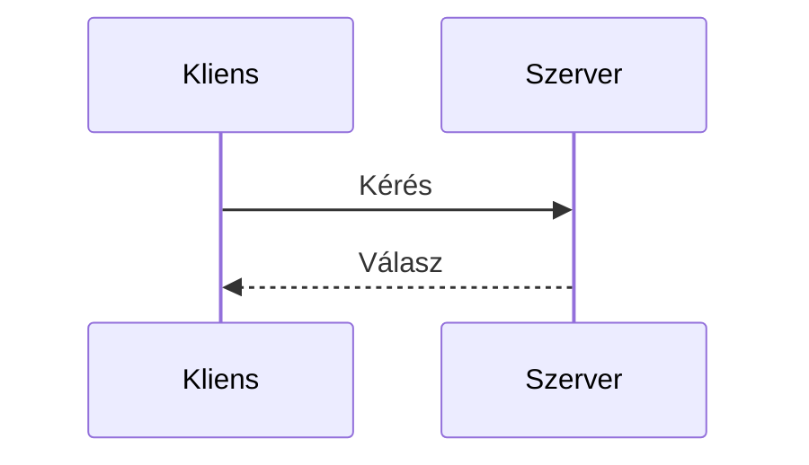
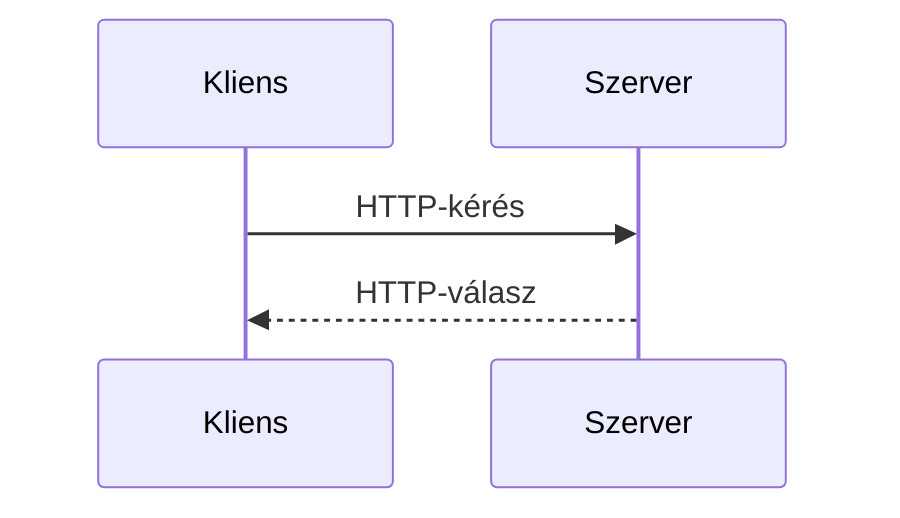
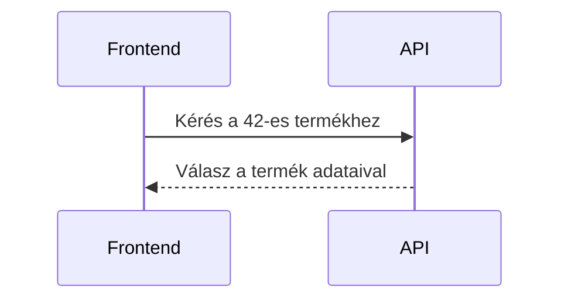
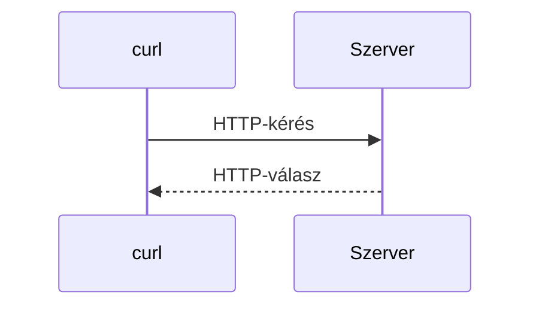
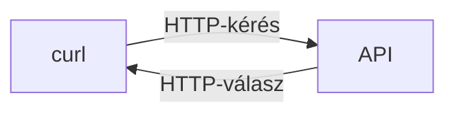

# Alapfogalmak

## Kliens és szerver

A weben történő kommunikáció gyakran **kliens–szerver modellben** zajlik.

* A **kliens** kezdeményezi a kommunikációt és kérést küld.
* A **szerver** fogadja a kérést, feldolgozza azt, majd választ küld.

Kliens lehet például egy webböngésző, egy mobilalkalmazás vagy egy parancssori program.



A kliens és a szerver nem feltétlenül egy adott eszköztípust jelöl, hanem azt a szerepet, amelyet egy program a kommunikáció során betölt.

---

## URL

A **URL** (*Uniform Resource Locator*) egy cím, amely megadja, hogy egy erőforrás hol érhető el.

Például:

```text
https://example.com/products/42
```

A cím néhány fontos része:

```text
https://example.com/products/42
└─┬──┘  └─────┬────┘└────┬─────┘
 séma          host        útvonal
```

* `https` – a használt séma;
* `example.com` – a host;
* `/products/42` – az elérni kívánt erőforrás útvonala.

A URL tehát megadja a kliens számára, hogy **hol található az az erőforrás, amellyel kommunikálni szeretne**.

---

## HTTP

A **HTTP** (*Hypertext Transfer Protocol*) egy protokoll, amely meghatározza a kliens és a szerver közötti kommunikáció szabályait.

A kommunikáció alapja a **kérés–válasz modell**:



A kliens HTTP-kérést küld a szervernek, a szerver pedig HTTP-választ küld vissza.

A HTTP tehát nem egy program, hanem egy szabályrendszer, amely alapján a két fél kommunikál egymással.

---

## API

Az **API** (*Application Programming Interface*, alkalmazásprogramozási interfész) egy olyan felület, amelyen keresztül egy program egy másik program által biztosított adatokat vagy funkciókat érhet el.

Az API általános fogalom, nem minden API működik HTTP-n keresztül. Webfejlesztés során azonban gyakran találkozunk olyan API-kkal, amelyek HTTP-n keresztül érhetők el.

### Példa

Tegyük fel, hogy egy webáruház frontendjét készítjük.

A termékek adatait egy szerver biztosítja, és ehhez egy API-t tesz elérhetővé.

Az egyik termék például ezen a címen érhető el:

```text
https://api.example.com/products/42
```

A frontend kérést küld erre a címre, a szerver pedig válaszol.



A frontendnek nem kell tudnia, hogyan működik a szerver belül. Elég tudnia, **hogyan érheti el az API-t, milyen kérést küldhet neki, és milyen választ várhat**.

---

# Hol kapcsolódik ehhez a `curl`?

A **curl egy parancssorból használható kliensprogram**, amellyel többek között HTTP- és HTTPS-kéréseket küldhetünk szervereknek.

Például:

```bash
curl https://example.com
```

Ebben az esetben:

* a `curl` a kliens;
* `https://example.com` egy URL;
* a `curl` kérést küld a szervernek;
* a szerver pedig választ küld vissza.



## Mire lehet hasznos?

Tegyük fel, hogy egy frontend fejlesztése során egy már elkészült API-t szeretnénk használni.

A dokumentáció szerint egy termék például ezen a címen érhető el:

```text
https://api.example.com/products/42
```

Mielőtt ezt a kérést beépítenénk a frontendbe, közvetlenül is kipróbálhatjuk az API-t:

```bash
curl https://api.example.com/products/42
```

Így gyorsan ellenőrizhetjük, hogy:

* az adott cím elérhető-e;
* válaszol-e rá a szerver;
* és milyen választ kapunk.



A `curl` tehát lehetővé teszi, hogy **egy webes szolgáltatással közvetlenül kommunikáljunk anélkül, hogy ehhez előbb külön frontendet kellene készítenünk**.

Ez különösen hasznos fejlesztés és hibakeresés során.
