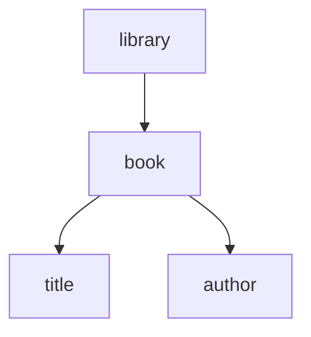
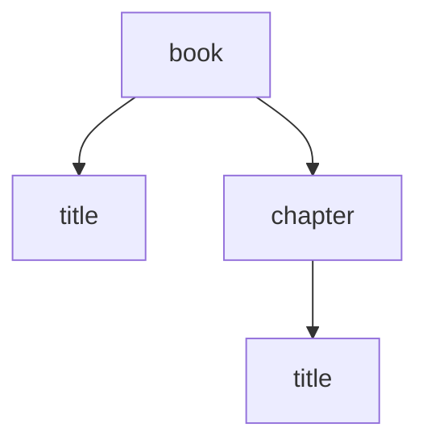
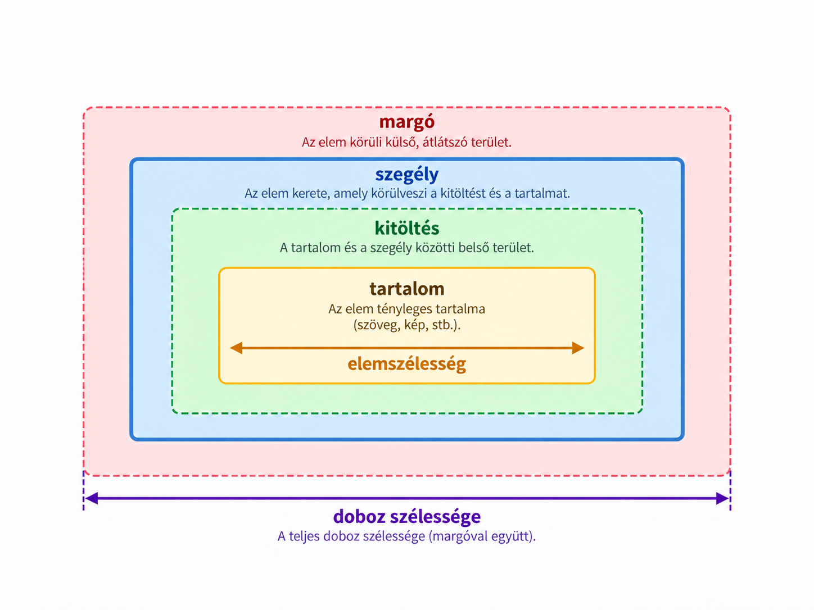
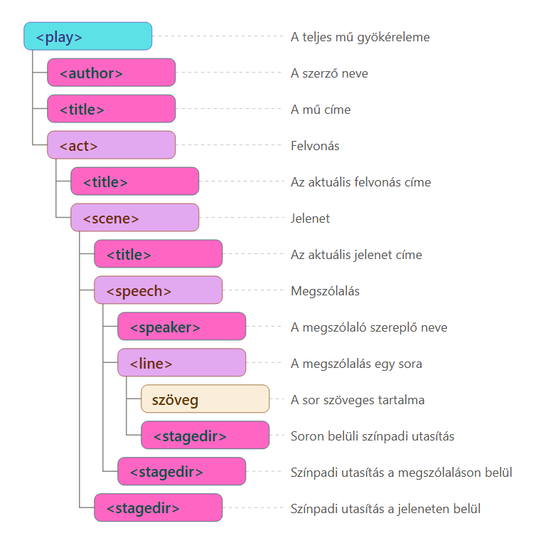

# 1. labor – XML és CSS

## Rövid elméleti bevezető

### Mi az XML?

Az **XML** (*Extensible Markup Language*) egy szöveges formátum és jelölőnyelv, amelynek segítségével **strukturált adatokat és dokumentumokat írhatunk le**. Az XML egyik fontos tulajdonsága, hogy nem ad előre rögzített elemkészletet. A dokumentum céljához illő elemneveket mi alakíthatjuk ki.

Egy egyszerű XML-dokumentum:

```xml
<?xml version="1.0" encoding="UTF-8"?>
<library>
    <book>
        <title>Hamlet</title>
        <author>William Shakespeare</author>
    </book>
</library>
```

Az XML szerkezete **fa jellegű**. A fenti példában a `library` a gyökérelem, ennek gyereke a `book`, a `book` közvetlen gyerekei pedig a `title` és az `author` elemek.



Ez a szülő–gyerek kapcsolat később a CSS-szelektorok használatánál is fontos lesz.

---

### Az XML-deklaráció


```xml
<?xml version="1.0" encoding="UTF-8"?>
```

A laborhoz használt **Red Hat XML** VS Code-bővítmény segít a deklaráció beszúrásában is. Egy új XML-fájl első sorában:

1. nyomjuk meg a `Ctrl+Space` billentyűkombinációt;
2. a megjelenő javaslatok közül válasszuk az XML-deklaráció beszúrására szolgáló snippetet, például az **Insert XML declaration** lehetőséget;
3. `Enter` vagy `Tab` után a deklaráció bekerül a dokumentumba.

A Red Hat XML dokumentációja szerint új XML-dokumentumban a `Ctrl+Space` a rendelkezésre álló snippeteket is megjeleníti, és a bővítmény kontextusfüggő XML-deklarációs snippetet biztosít.

---

### A jól formázott XML legfontosabb szabályai

Egy XML-dokumentumnak szintaktikailag **jól formázottnak** kell lennie. A laborhoz a következő szabályok a legfontosabbak.

#### 1. Pontosan egy gyökérelem van

```xml
<library>
    ...
</library>
```

A teljes dokumentumban pontosan egy olyan elem van, amely nincs másik elem belsejében: ez a **gyökérelem** (*root element* vagy *document element*). Minden más elem közvetlenül vagy közvetve ennek a belsejében található.

Ezért ez hibás XML:

```xml
<book>...</book>
<author>...</author>
```

Itt két egymás melletti legfelső szintű elem lenne.

#### 2. Az elemeket szabályosan le kell zárni

Egy nem üres elemhez kezdő- és zárócímke tartozik:

```xml
<title>Hamlet</title>
```

A kezdő- és zárócímke nevének meg kell egyeznie.

Üres elem rövid alakban is megadható:

```xml
<break />
```

#### 3. Az elemeket szabályosan egymásba kell ágyazni

Helyes:

```xml
<book>
    <title>Hamlet</title>
</book>
```

Hibás:

```xml
<book>
    <title>Hamlet</book>
</title>
```

Ha egy elem egy másik elem belsejében kezdődik, akkor ott is kell befejeződnie. A címkék tehát nem keresztezhetik egymást.

#### 4. Az XML megkülönbözteti a kis- és nagybetűket

A következők különböző elemnevek:

```xml
<title>
<Title>
<TITLE>
```

Ha például `<title>` nyitócímkét használunk, azt `</title>` formában kell lezárni.

#### 5. Az attribútumértékeket idézőjelbe kell tenni

Helyes:

```xml
<book language="en">
```

Az idézőjel lehet egyszeres vagy kettős, de az attribútumértéknek idézőjelek között kell szerepelnie.

#### 6. Ugyanaz az attribútum egy kezdőcímkében nem szerepelhet kétszer

Hibás például:

```xml
<book language="en" language="hu">
```

#### 7. Bizonyos karaktereket nem írhatunk közvetlenül szövegként

A `<` és az `&` karakternek XML-ben különleges jelentése van, ezért ha tényleges karakterként szeretnénk megjeleníteni őket, karakterhivatkozást használunk:

```xml
&lt;
&amp;
```

Például:

```xml
<line>A &amp; B</line>
```

#### 8. Megjegyzéseket is írhatunk a dokumentumba

```xml
<!-- Ez egy megjegyzés. -->
```

A megjegyzés nem része az elem szöveges tartalmának, de hasznos lehet például a forrás vagy más fejlesztői információ feltüntetésére.

---

## XML-elemek gyors létrehozása VS Code-ban

A VS Code támogatja az **Emmetet**, és az Emmet XML-fájlokban is használható.

Ha például már rendelkezésre áll a következő szöveg:

```text
William Shakespeare
```

és ezt egy `author` elembe szeretnénk becsomagolni, nem szükséges kézzel megírni a két címkét.

1. Jelöljük ki a `William Shakespeare` szöveget.
2. Nyomjuk meg a `Ctrl+Shift+P` billentyűkombinációt a Command Palette megnyitásához.
3. Válasszuk az **Emmet: Wrap with Abbreviation** parancsot.
4. Írjuk be:

   ```text
   author
   ```

5. Nyomj `Enter`-t.

Az eredmény:

```xml
<author>William Shakespeare</author>
```

Az **Emmet: Wrap with Abbreviation** parancshoz a VS Code nem garantál külön, minden telepítésen azonos alapértelmezett billentyűkombinációt. A biztosan használható megoldás ezért a `Ctrl+Shift+P` és a parancs kiválasztása. Ha valaki gyakran használja, a VS Code Keyboard Shortcuts nézetében saját gyorsbillentyűt is rendelhet hozzá.

Az Emmet egyszerű elemstruktúrák gyors létrehozására is használható. Például:

```text
book>title+author
```

Emmet-kifejezésként kibontva egy egymásba ágyazott szerkezetet hozhat létre:

```xml
<book>
    <title></title>
    <author></author>
</book>
```

---

# XML megjelenítése CSS segítségével

Az XML-ben létrehozott elemek elsődleges feladata az adatok **szerkezetének és jelentésének leírása**. A saját elemneveinkhez önmagukban nem tartozik olyan előre meghatározott megjelenés, mint sok HTML-elemhez.

Ha azt szeretnénk, hogy az XML-dokumentum a böngészőben meghatározott módon jelenjen meg, CSS-stíluslapot kapcsolhatunk hozzá.

```xml
<?xml-stylesheet type="text/css" href="play.css"?>
```

Ez egy **feldolgozási utasítás** (*processing instruction*), amely megadja a feldolgozó alkalmazásnak, hogy a dokumentum megjelenítéséhez a `play.css` stíluslapot használja.

A dokumentum eleje tehát például így nézhet ki:

```xml
<?xml version="1.0" encoding="UTF-8"?>
<?xml-stylesheet type="text/css" href="play.css"?>
<play>
    ...
</play>
```

---

## A CSS-szabály felépítése

Egy egyszerű CSS-szabály:

```css
title {
    font-weight: bold;
}
```

Két fő része van:

- a **szelektor** (`title`) meghatározza, hogy mely elemeket választjuk ki;
- a deklarációs blokkban található **tulajdonság–érték párok** (`font-weight: bold`) megadják, hogyan jelenjenek meg a kiválasztott elemek.

Általánosan:

```css
selector {
    property: value;
}
```


---

## Elemnév szerinti kiválasztás

```css
title {
    font-weight: bold;
}
```

Ez az XML-dokumentum **összes `title` elemét** kiválasztja, függetlenül attól, hogy azok a dokumentum melyik részén találhatók.

---

## Univerzális szelektor: `*`

```css
* {
    display: block;
}
```

A `*` univerzális szelektor minden elemet kiválaszt.

A laborban ez azért hasznos, mert kiindulásként az összes XML-elemet blokkszintű megjelenítésre állíthatjuk, majd azokat, amelyeknek egy soron belül kell maradniuk, külön visszaállíthatjuk `inline` megjelenítésre.

---

## Több szelektor felsorolása vesszővel

Ha több különböző elemre ugyanazokat a deklarációkat szeretnénk alkalmazni, a szelektorokat vesszővel sorolhatjuk fel:

```css
author, title {
    text-align: center;
}
```

Ez minden `author` és minden `title` elemre vonatkozik.

A vessző itt nem szülő–gyerek kapcsolatot jelent, hanem egyszerűen **több különálló szelektort csoportosít** egy közös szabályhoz.

---

## Közvetlen gyerek kiválasztása: `>`

```css
book > title {
    font-size: larger;
}
```

Az `A > B` forma azokat a `B` elemeket választja ki, amelyeknek **közvetlen szülője** egy `A` elem.

Például:

```xml
<book>
    <title>Első cím</title>
    <chapter>
        <title>Második cím</title>
    </chapter>
</book>
```

A következő szelektor:

```css
book > title
```

csak az `Első cím` elemét választja ki. A `chapter` belsejében lévő `title` ugyan leszármazottja a `book` elemnek, de **nem közvetlen gyereke**.



Ez a laborban azért fontos, mert ugyanaz az elemnév eltérő szerepet tölthet be attól függően, hogy hol található. Például másképpen formázható a mű közvetlen `title` gyereke és egy `scene` közvetlen `title` gyereke.

---

## Pszeudoelemek és a `::` jelölés

A **pszeudoelem** lehetővé teszi, hogy egy kiválasztott elem egy meghatározott részét vagy a megjelenítés során létrejövő virtuális részt célozzunk meg és formázzunk.

A pszeudoelemeket dupla kettősponttal jelöljük:

```css
selector::pseudo-element {
    ...
}
```

Például léteznek olyan pszeudoelemek, amelyek egy szöveg első sorát vagy első betűjét célozzák.
### `::before`

Az elem tartalmának megjelenítése **elé** hozhat létre generált tartalmat.

### `::after`

Az elem tartalmának megjelenítése **után** hozhat létre generált tartalmat.

Például:

```css
note::before {
    content: "(";
}

note::after {
    content: ")";
}
```

Ha az XML-ben ez szerepel:

```xml
<note>whispers</note>
```

akkor a megjelenített eredmény lehet:

```text
(whispers)
```

Fontos, hogy a két zárójel ettől **nem kerül bele az XML-dokumentumba**. Az XML továbbra is csak ezt tartalmazza:

```xml
<note>whispers</note>
```

A zárójelek a CSS által létrehozott megjelenítés részei.

---

### A `display` tulajdonság

A `display` tulajdonság alapvetően meghatározza, hogy egy elem **hogyan vesz részt az oldal elrendezésében**, illetve hogyan helyezkedik el a környezetében lévő többi elemhez képest.


#### `display: block`

A `block` típusú elem egy **blokkot** alkot.

Főbb tulajdonságai:

* az elem **új sorban kezdődik**;
* az utána következő blokk szintű elem is új sorba kerül;
* ha nem adunk meg külön `width` értéket, az elem általában kitölti a rendelkezésére álló vízszintes területet;
* a `width` és `height` tulajdonságok alkalmazhatók rá

Például:

```css
scene {
    display: block;
    width: 500px;
    height: 200px;
    margin: 20px;
    padding: 10px;
}
```

Ebben az esetben a `scene` egy külön blokkot alkot, amelynek megadható a szélessége és a magassága.

---

#### `display: inline`

Az `inline` típusú elem ezzel szemben **nem kezd automatikusan új sort**. Az elemek egymás mellett, ugyanabban a szövegsorban is elhelyezkedhetnek, amíg van számukra elegendő hely.

Például:

```css
speaker {
    display: inline;
}
```

Ha több ilyen elem követi egymást, nem keletkezik közöttük automatikusan sortörés.

Az `inline` elemek dobozmodellje azonban néhány fontos ponton eltér a `block` elemekétől.

Normál `inline` elem esetén:

* a `width` **nincs hatással az elem méretére**;
* a `height` **nincs hatással az elem méretére**;
* a `margin-left` és `margin-right` működik


## A CSS dobozmodell

A CSS az elemeket az elrendezés során **dobozokként** kezeli. Egy elem megjelenített területét egymásra épülő részek alkotják: középen található a **tartalom** (*content*), ezt veheti körül a **kitöltés** (*padding*), majd a **szegély** (*border*), a szegélyen kívül pedig a **margó** (*margin*) biztosíthat térközt a környező elemekhez képest.

Az alábbi ábra ezek egymáshoz való viszonyát szemlélteti:



---

## `margin` és `padding`

A `margin` az elem **külső térközét**, a `padding` pedig az elem tartalma és saját határa közötti **belső térközt** szabályozza.

Az oldalak külön is megadhatók:

```css
margin-top: 1px;
margin-right: 2px;
margin-bottom: 1px;
margin-left: 2px;
```

A CSS azonban úgynevezett **shorthand**, vagyis összevont tulajdonságokat is támogat. Ugyanez rövidebben:

```css
margin: 1px 2px;
```

A `margin` és a `padding` esetében 1–4 értéket adhatunk meg.

### Egy érték

```css
margin: 1px;
```

Mind a négy oldal:

```text
top = right = bottom = left = 1em
```

### Két érték

```css
margin: 1px 2px;
```

Az első érték a függőleges, a második a vízszintes oldalakat jelenti:

```text
top    = 1em
bottom = 1em
right  = 2em
left   = 2em
```

Vagy röviden:

```text
függőleges | vízszintes
```

### Három érték

```css
margin: 1em 2em 3em;
```

A sorrend:

```text
top | right és left | bottom
```

tehát:

```text
top    = 1em
right  = 2em
left   = 2em
bottom = 3em
```

### Négy érték

```css
margin: 1em 2em 3em 4em;
```

A sorrend **az óramutató járásával megegyezően**:

```text
top | right | bottom | left
```

vagyis:

```text
top    = 1em
right  = 2em
bottom = 3em
left   = 4em
```

Ugyanez a 1–4 értékes szabály érvényes a `padding` tulajdonságra is.


---

## A `margin: auto`


```css
play {
    max-width: 70px;
    margin: auto;
}
```

A `max-width` korlátozza az elem maximális szélességét. Bizonyos elrendezési helyzetekben az automatikus bal és jobb margó segítségével a böngésző a rendelkezésre álló vízszintes helyet egyenletesen osztja el, ezért az elem középre kerülhet.

A gyakorlatban gyakori változat:

```css
margin: 0 auto;
```

Ez azt jelenti:

```text
felső és alsó margó = 0
bal és jobb margó   = auto
```

---

## Más összevont CSS-tulajdonságok

A CSS-ben nem csak a `margin` és `padding` rövidíthető. Több tulajdonság úgynevezett shorthand formában egyszerre több részértéket is megadhat.


```css
border-top: medium double black;
```

Ez egyetlen deklarációban adja meg a felső szegély több jellemzőjét: a vastagságát, stílusát és színét.

Hasonlóan egy árnyék több jellemzője is egy deklarációban szerepelhet:

```css
text-shadow: 1px 1px 2px gray;
```

---

## Öröklődés röviden

Egyes CSS-tulajdonságok értékei a szülőelemről a gyerekelemekre is öröklődhetnek. Például ha a gyökérhez közeli elemre betűtípust állítunk:

```css
play {
    font-family: "Palatino Linotype", Palatino, "Times New Roman", serif;
}
```

akkor a benne található szöveges elemek jellemzően ugyanezt a betűtípust használják, amíg egy specifikusabb szabály felül nem írja azt.

Nem minden tulajdonság öröklődik.


---
https://quizlet.com/hu/1205024248/labor-1-flash-cards/?i=79t58a&x=1jqt

# Feladat:
Ültesd át a [hamlet.txt](hamlet.txt) állomány tartalmát XML-be. Készíts a dokumentum megjelenítéséhez egy CSS stíluslapot, amely az [itt](hamlet.png) látható elrendezést eredményezi a böngészőben.

A munka megkezdése előtt telepítsd a Visual Studio Code-ban a RedHat [XML](https://marketplace.visualstudio.com/items?itemName=redhat.vscode-xml) bővítményét.

## Hogyan kezdjünk neki a feladatnak?

Egy csupasz szövegfájl elsőre ijesztő lehet: nincs benne egyetlen címke sem. Íme néhány tipp, hogy hogyan lehet ezt mégis kicsit könnyebben nekifutni :)

> **Minek mije van?** és **mi miből áll?**

### Kezdjük a legnagyobb egységgel

Itt ez maga a mű, ez lesz a gyökérelem: `play`.

- **Mije van?** Címe és szerzője -> `title`, `author`
- **Miből áll?** Felvonásokból -> `act`

```xml
<play>
    <author>...</author>
    <title>...</title>
    <act>...</act>
</play>
```

### Aztán ugyanez a két kérdés egy szinttel lejjebb

- **Felvonás:** van címe (`title`), és jelenetekből áll (`scene`)
- **Jelenet:** van címe (`title`), megszólalásokból áll (`speech`), és lehetnek benne színpadi utasítások (`stagedir`)
- **Megszólalás:** van beszélője (`speaker`), sorokból áll (`line`), és itt is előfordulhat színpadi utasítás (`stagedir`)
- **Sor:** szöveget tartalmaz, és lehet benne soron belüli színpadi utasítás (`stagedir`)

